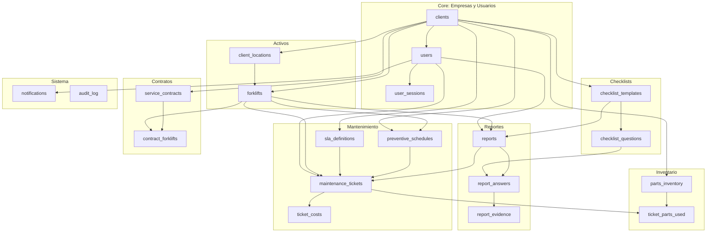
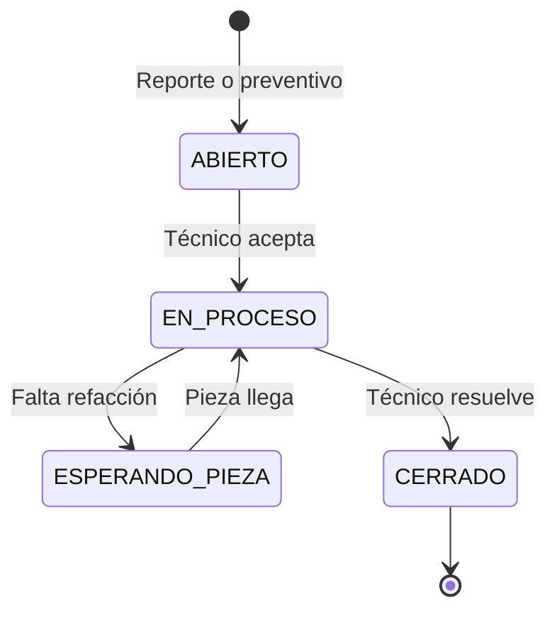

# CMMS B2B SaaS — Documentación de Base de Datos v2

> **Motor**: Spanner PostgreSQL  
> **Enfoque**: Rentabilidad y Transparencia  
> **Tablas**: 20  |  **Índices**: 15

---

## Arquitectura General

---

## Módulos

### 1. Core: Empresas y Usuarios

#### `clients`
Tabla raíz del sistema multi-tenant. Cada empresa cliente tiene su propio scope de datos.

| Campo | Tipo | Restricción | Descripción |
|-------|------|-------------|-------------|
| `id` | VARCHAR(36) | PK | UUID |
| `name` | VARCHAR(255) | NOT NULL | Razón social |
| `contact_email` | VARCHAR(255) | | Email de contacto |
| `phone` | VARCHAR(20) | | Teléfono |
| `tax_id` | VARCHAR(20) | | RFC para facturación |
| `billing_address` | TEXT | | Dirección fiscal |
| `subscription_plan` | VARCHAR(50) | DEFAULT 'BASIC' | BASIC, PRO, ENTERPRISE |
| `is_active` | BOOLEAN | DEFAULT TRUE | Cliente activo/inactivo |
| `created_at` | TIMESTAMPTZ | DEFAULT NOW | Fecha de alta |

---

#### `users`
Usuarios del sistema con roles diferenciados.

| Campo | Tipo | Restricción | Descripción |
|-------|------|-------------|-------------|
| `id` | VARCHAR(36) | PK | UUID |
| `full_name` | VARCHAR(255) | NOT NULL | Nombre completo |
| `role` | VARCHAR(50) | NOT NULL | OPERADOR, TECNICO, ADMIN, CLIENTE |
| `client_id` | VARCHAR(36) | FK → clients | NULL = empleado de la agencia |
| `email` | VARCHAR(255) | UNIQUE* | Email de acceso |
| `phone` | VARCHAR(20) | | Teléfono directo |
| `password_hash` | TEXT | NOT NULL | Hash bcrypt |
| `is_active` | BOOLEAN | DEFAULT TRUE | Cuenta activa |
| `last_login_at` | TIMESTAMPTZ | | Último acceso |
| `created_at` | TIMESTAMPTZ | DEFAULT NOW | Fecha de registro |

> \* UNIQUE se aplica mediante índice externo `users_email_unique`

**Roles del sistema:**

| Rol | Descripción | Acceso |
|-----|-------------|--------|
| `OPERADOR` | Conduce el montacargas | App móvil: checklists diarios |
| `TECNICO` | Repara el montacargas | App: tickets asignados |
| `ADMIN` | Gestiona la agencia | Dashboard completo |
| `CLIENTE` | Supervisor del cliente | Dashboard de su empresa |

---

#### `user_sessions`
Control de sesiones activas para seguridad.

| Campo | Tipo | Restricción | Descripción |
|-------|------|-------------|-------------|
| `id` | VARCHAR(36) | PK | UUID |
| `user_id` | VARCHAR(36) | FK → users, NOT NULL | Usuario dueño de la sesión |
| `token_hash` | TEXT | NOT NULL | Hash del JWT/token |
| `device_info` | TEXT | | "iPhone 14 / Android 13" |
| `ip_address` | TEXT | | IP del dispositivo |
| `created_at` | TIMESTAMPTZ | DEFAULT NOW | Inicio de sesión |
| `expires_at` | TIMESTAMPTZ | NOT NULL | Expiración del token |

---

### 2. Activos: Montacargas y Ubicaciones

#### `client_locations`
Plantas o sucursales donde operan los montacargas.

| Campo | Tipo | Restricción | Descripción |
|-------|------|-------------|-------------|
| `id` | VARCHAR(36) | PK | UUID |
| `client_id` | VARCHAR(36) | FK → clients, NOT NULL | A qué empresa pertenece |
| `name` | VARCHAR(255) | NOT NULL | "Planta Monterrey" |
| `address` | TEXT | | Dirección completa |
| `gps_latitude` | DOUBLE PRECISION | | Latitud GPS |
| `gps_longitude` | DOUBLE PRECISION | | Longitud GPS |

---

#### `forklifts`
Registro de montacargas (activos principales del sistema).

| Campo | Tipo | Restricción | Descripción |
|-------|------|-------------|-------------|
| `id` | VARCHAR(36) | PK | UUID |
| `internal_id` | VARCHAR(50) | NOT NULL | Código interno: "M1551" |
| `serial_number` | VARCHAR(100) | | Número de serie del fabricante |
| `qr_code_payload` | VARCHAR(255) | NOT NULL, UNIQUE* | Contenido del QR para escaneo |
| `model` | VARCHAR(100) | | Modelo del equipo |
| `brand` | VARCHAR(100) | | Toyota, Yale, Crown |
| `year` | INT | | Año del equipo |
| `fuel_type` | VARCHAR(50) | | ELECTRICO, GAS_LP, DIESEL |
| `client_id` | VARCHAR(36) | FK → clients, NOT NULL | Dueño del montacargas |
| `location_id` | VARCHAR(36) | FK → client_locations | Planta donde está asignado |
| `operational_status` | VARCHAR(20) | DEFAULT 'OPERATIONAL' | Estado operativo actual |
| `current_hours` | NUMERIC | | Horómetro actual |
| `last_sync_at` | TIMESTAMPTZ | | Última sincronización |

> \* UNIQUE se aplica mediante índice externo `idx_forklifts_qr`

**Estados operativos:**

| Estado | Descripción |
|--------|-------------|
| `OPERATIONAL` | En servicio normal |
| `MAINTENANCE` | En reparación |
| `OUT_OF_SERVICE` | Fuera de servicio |

---

### 3. Checklists: Templates y Preguntas

#### `checklist_templates`
Versiones del checklist de inspección.

| Campo | Tipo | Restricción | Descripción |
|-------|------|-------------|-------------|
| `id` | VARCHAR(36) | PK | UUID |
| `name` | VARCHAR(100) | NOT NULL | Nombre del checklist |
| `version` | INT | NOT NULL | Número de versión |
| `client_id` | VARCHAR(36) | FK → clients | NULL = template global |
| `is_active` | BOOLEAN | DEFAULT TRUE | Versión vigente |

---

#### `checklist_questions`
Preguntas individuales del checklist con niveles de severidad.

| Campo | Tipo | Restricción | Descripción |
|-------|------|-------------|-------------|
| `id` | VARCHAR(36) | PK | UUID |
| `template_id` | VARCHAR(36) | FK → checklist_templates, NOT NULL | Versión del checklist |
| `question_text` | TEXT | NOT NULL | Texto de la pregunta |
| `question_type` | VARCHAR(50) | NOT NULL | Tipo de respuesta esperada |
| `severity_level` | VARCHAR(20) | DEFAULT 'INFO' | Nivel de gravedad |
| `requires_evidence` | BOOLEAN | DEFAULT FALSE | ¿Requiere foto/video? |
| `order_index` | INT | | Orden de aparición |

**Niveles de severidad:**

| Nivel | Acción | Ejemplo |
|-------|--------|---------|
| `INFO` | Solo informativo | Nivel de batería |
| `WARNING` | Genera ticket, máquina sigue | Asiento dañado |
| `CRITICAL_STOP` | Inmoviliza la máquina | Frenos fallando, sin cinturón |

---

### 4. Reportes: Inspecciones Diarias

#### `reports`
Encabezado del reporte de inspección diaria.

| Campo | Tipo | Restricción | Descripción |
|-------|------|-------------|-------------|
| `id` | VARCHAR(36) | PK | UUID |
| `forklift_id` | VARCHAR(36) | FK → forklifts, NOT NULL | Montacargas inspeccionado |
| `user_id` | VARCHAR(36) | FK → users, NOT NULL | Operador que hizo la inspección |
| `template_id` | VARCHAR(36) | FK → checklist_templates | Versión del checklist usada |
| `captured_at` | TIMESTAMPTZ | NOT NULL | Hora real del dispositivo (offline) |
| `synced_at` | TIMESTAMPTZ | DEFAULT NOW | Hora del servidor al sincronizar |
| `gps_latitude` | DOUBLE PRECISION | | Latitud anti-fraude |
| `gps_longitude` | DOUBLE PRECISION | | Longitud anti-fraude |
| `has_critical_failure` | BOOLEAN | DEFAULT FALSE | TRUE si falló frenos/cinturón |

> **Anti-fraude**: `captured_at` vs `synced_at` permite detectar si un reporte fue llenado a destiempo. Las coordenadas GPS validan que el operador estaba en planta.

---

#### `report_answers`
Respuesta individual a cada pregunta del checklist.

| Campo | Tipo | Restricción | Descripción |
|-------|------|-------------|-------------|
| `id` | VARCHAR(36) | PK | UUID |
| `report_id` | VARCHAR(36) | FK → reports, NOT NULL | Reporte padre |
| `question_id` | VARCHAR(36) | FK → checklist_questions, NOT NULL | Pregunta respondida |
| `answer_value` | VARCHAR(255) | | Valor de la respuesta |
| `is_flagged` | BOOLEAN | DEFAULT FALSE | Respuesta con problema |

---

#### `report_evidence`
Evidencia multimedia almacenada en Cloudflare R2.

| Campo | Tipo | Restricción | Descripción |
|-------|------|-------------|-------------|
| `id` | VARCHAR(36) | PK | UUID |
| `answer_id` | VARCHAR(36) | FK → report_answers, NOT NULL | Respuesta asociada |
| `media_url` | TEXT | NOT NULL | URL de Cloudflare R2 |
| `media_type` | VARCHAR(50) | DEFAULT 'image/jpeg' | image/jpeg, video/mp4 |
| `captured_at` | TIMESTAMPTZ | | Metadata de la foto |

> **URL ejemplo**: `https://pub-xxxx.r2.dev/evidence/report-123/img-001.jpg`

---

### 5. Mantenimiento: SLAs, Preventivos, Tickets y Costos

#### `sla_definitions`
Acuerdos de nivel de servicio por cliente y prioridad.

| Campo | Tipo | Restricción | Descripción |
|-------|------|-------------|-------------|
| `id` | VARCHAR(36) | PK | UUID |
| `client_id` | VARCHAR(36) | FK → clients, NOT NULL | Cliente al que aplica |
| `priority` | VARCHAR(20) | NOT NULL | ALTA, MEDIA, BAJA |
| `max_response_minutes` | INT | NOT NULL | Minutos máximo para asignar técnico |
| `max_resolution_minutes` | INT | NOT NULL | Minutos máximo para resolver |
| `penalty_per_breach` | NUMERIC | | Penalización económica por incumplimiento |

---

#### `preventive_schedules`
Planes de mantenimiento preventivo programado.

| Campo | Tipo | Restricción | Descripción |
|-------|------|-------------|-------------|
| `id` | VARCHAR(36) | PK | UUID |
| `forklift_id` | VARCHAR(36) | FK → forklifts | NULL = aplica a todos/por modelo |
| `client_id` | VARCHAR(36) | FK → clients, NOT NULL | Cliente dueño del plan |
| `target_model` | VARCHAR(100) | | Si forklift_id es NULL, aplica a este modelo |
| `task_name` | VARCHAR(255) | NOT NULL | "Cambio de aceite hidráulico" |
| `frequency_type` | VARCHAR(20) | NOT NULL | HOURS, DAYS, CALENDAR |
| `frequency_value` | INT | NOT NULL | Cada 250 hrs o cada 30 días |
| `next_due_at` | TIMESTAMPTZ | | Próxima fecha programada |
| `next_due_hours` | NUMERIC | | Próximo horómetro programado |
| `is_active` | BOOLEAN | DEFAULT TRUE | Plan activo |
| `created_at` | TIMESTAMPTZ | DEFAULT NOW | Fecha de creación |

---

#### `maintenance_tickets`
Tickets de mantenimiento correctivo (desde reportes) y preventivo (desde schedules).

| Campo | Tipo | Restricción | Descripción |
|-------|------|-------------|-------------|
| `id` | VARCHAR(36) | PK | UUID |
| `ticket_number` | BIGINT | | Número legible generado por la app: TKT-0001 |
| `report_id` | VARCHAR(36) | FK → reports | NULL si es ticket preventivo |
| `forklift_id` | VARCHAR(36) | FK → forklifts, NOT NULL | Montacargas afectado |
| `assigned_to` | VARCHAR(36) | FK → users | Técnico asignado |
| `sla_id` | VARCHAR(36) | FK → sla_definitions | SLA aplicable |
| `schedule_id` | VARCHAR(36) | FK → preventive_schedules | Si fue generado por un preventivo |
| `status` | VARCHAR(50) | NOT NULL | Estado actual del ticket |
| `priority` | VARCHAR(20) | DEFAULT 'MEDIA' | Prioridad del ticket |
| `created_at` | TIMESTAMPTZ | NOT NULL | Apertura del ticket |
| `assigned_at` | TIMESTAMPTZ | | Hora de asignación a técnico |
| `resolved_at` | TIMESTAMPTZ | | Hora de cierre |
| `resolution_notes` | TEXT | | Notas del técnico al cerrar |

**Flujo de estados:**

**Origen del ticket:**

| Origen | report_id | schedule_id |
|--------|-----------|-------------|
| Correctivo (desde reporte) | ✅ ID del reporte | NULL |
| Preventivo (desde schedule) | NULL | ✅ ID del schedule |

---

#### `ticket_costs`
Desglose detallado de costos por ticket (clave para rentabilidad).

| Campo | Tipo | Restricción | Descripción |
|-------|------|-------------|-------------|
| `id` | VARCHAR(36) | PK | UUID |
| `ticket_id` | VARCHAR(36) | FK → maintenance_tickets, NOT NULL | Ticket padre |
| `cost_type` | VARCHAR(50) | NOT NULL | Tipo de costo |
| `description` | TEXT | | Detalle del costo |
| `quantity` | NUMERIC | DEFAULT 1.0 | Cantidad |
| `unit_cost` | NUMERIC | NOT NULL | Costo unitario |
| `total_cost` | NUMERIC | NOT NULL | Total = quantity × unit_cost |
| `is_billable` | BOOLEAN | DEFAULT TRUE | ¿Se cobra al cliente? |
| `created_at` | TIMESTAMPTZ | DEFAULT NOW | Fecha de registro |

**Tipos de costo:**

| Tipo | Descripción |
|------|-------------|
| `MATERIAL` | Materiales consumibles |
| `MANO_DE_OBRA` | Horas técnico |
| `VIATICO` | Traslado, hospedaje |
| `REFACCION` | Piezas de repuesto |

---

### 6. Inventario: Refacciones

#### `parts_inventory`
Catálogo de refacciones con control de stock.

| Campo | Tipo | Restricción | Descripción |
|-------|------|-------------|-------------|
| `id` | VARCHAR(36) | PK | UUID |
| `part_number` | VARCHAR(100) | NOT NULL, UNIQUE* | Número de parte del fabricante |
| `name` | VARCHAR(255) | NOT NULL | Nombre de la refacción |
| `current_stock` | INT | DEFAULT 0 | Stock actual |
| `min_stock` | INT | DEFAULT 1 | Alerta cuando baje de aquí |
| `unit_cost` | NUMERIC | | Costo unitario |
| `supplier` | VARCHAR(255) | | Proveedor |
| `client_id` | VARCHAR(36) | FK → clients | NULL = inventario de la agencia |
| `updated_at` | TIMESTAMPTZ | DEFAULT NOW | Última actualización |

> \* UNIQUE se aplica mediante índice externo `idx_parts_number`

---

#### `ticket_parts_used`
Refacciones usadas en cada ticket (descuenta del inventario).

| Campo | Tipo | Restricción | Descripción |
|-------|------|-------------|-------------|
| `id` | VARCHAR(36) | PK | UUID |
| `ticket_id` | VARCHAR(36) | FK → maintenance_tickets, NOT NULL | Ticket donde se usó |
| `part_id` | VARCHAR(36) | FK → parts_inventory, NOT NULL | Refacción utilizada |
| `quantity` | INT | DEFAULT 1 | Cantidad usada |

---

### 7. Contratos: Modelo Financiero

#### `service_contracts`
Contratos de servicio con clientes.

| Campo | Tipo | Restricción | Descripción |
|-------|------|-------------|-------------|
| `id` | VARCHAR(36) | PK | UUID |
| `client_id` | VARCHAR(36) | FK → clients, NOT NULL | Cliente del contrato |
| `contract_type` | VARCHAR(50) | NOT NULL | Tipo de cobro |
| `monthly_fee` | NUMERIC | | Cuota mensual fija |
| `hourly_rate` | NUMERIC | | Tarifa por hora |
| `start_date` | DATE | NOT NULL | Inicio del contrato |
| `end_date` | DATE | | Fin del contrato (NULL = indefinido) |
| `is_active` | BOOLEAN | DEFAULT TRUE | Contrato vigente |
| `created_at` | TIMESTAMPTZ | DEFAULT NOW | Fecha de registro |

**Tipos de contrato:**

| Tipo | Descripción | Campo principal |
|------|-------------|----------------|
| `POR_HORA` | Se cobra por hora de servicio | `hourly_rate` |
| `MENSUAL_FIJO` | Cuota fija mensual | `monthly_fee` |
| `POR_EVENTO` | Se cobra por cada ticket | Ambos posibles |

---

#### `contract_forklifts`
Tabla puente: qué montacargas cubre cada contrato.

| Campo | Tipo | Restricción | Descripción |
|-------|------|-------------|-------------|
| `id` | VARCHAR(36) | PK | UUID |
| `contract_id` | VARCHAR(36) | FK → service_contracts, NOT NULL | Contrato |
| `forklift_id` | VARCHAR(36) | FK → forklifts, NOT NULL | Montacargas cubierto |

---

### 8. Sistema: Notificaciones y Auditoría

#### `notifications`
Alertas push/in-app para usuarios.

| Campo | Tipo | Restricción | Descripción |
|-------|------|-------------|-------------|
| `id` | VARCHAR(36) | PK | UUID |
| `user_id` | VARCHAR(36) | FK → users, NOT NULL | Destinatario |
| `type` | VARCHAR(50) | NOT NULL | Tipo de notificación |
| `title` | VARCHAR(255) | NOT NULL | Título de la alerta |
| `body` | TEXT | | Contenido detallado |
| `is_read` | BOOLEAN | DEFAULT FALSE | Leída/no leída |
| `created_at` | TIMESTAMPTZ | DEFAULT NOW | Fecha de envío |

**Tipos de notificación:**

| Tipo | Trigger |
|------|---------|
| `TICKET_ASSIGNED` | Ticket asignado a un técnico |
| `SLA_BREACH` | Se excedió el tiempo del SLA |
| `PM_DUE` | Preventivo próximo a vencer |

---

#### `audit_log`
Bitácora de auditoría para transparencia total.

| Campo | Tipo | Restricción | Descripción |
|-------|------|-------------|-------------|
| `id` | VARCHAR(36) | PK | UUID |
| `user_id` | VARCHAR(36) | | Usuario que realizó la acción |
| `client_id` | VARCHAR(36) | | Cliente afectado |
| `action` | VARCHAR(100) | NOT NULL | Acción realizada |
| `entity_type` | VARCHAR(50) | NOT NULL | Tipo de entidad afectada |
| `entity_id` | VARCHAR(36) | NOT NULL | ID de la entidad |
| `old_value` | TEXT | | JSON del estado anterior |
| `new_value` | TEXT | | JSON del estado nuevo |
| `ip_address` | TEXT | | IP del usuario |
| `created_at` | TIMESTAMPTZ | DEFAULT NOW | Timestamp de la acción |

**Acciones registradas:**

| Acción | Descripción |
|--------|-------------|
| `REPORT_SUBMITTED` | Reporte enviado |
| `TICKET_CREATED` | Ticket abierto |
| `TICKET_CLOSED` | Ticket cerrado |
| `STATUS_CHANGED` | Cambio de estado |
| `FORKLIFT_DISABLED` | Montacargas fuera de servicio |

---

## Índices de Performance

| Índice | Tabla | Columna(s) | Tipo |
|--------|-------|------------|------|
| `users_email_unique` | users | email | UNIQUE |
| `idx_forklifts_qr` | forklifts | qr_code_payload | UNIQUE |
| `idx_parts_number` | parts_inventory | part_number | UNIQUE |
| `idx_reports_forklift` | reports | forklift_id | INDEX |
| `idx_reports_user` | reports | user_id | INDEX |
| `idx_reports_captured` | reports | captured_at | INDEX |
| `idx_tickets_status` | maintenance_tickets | status | INDEX |
| `idx_tickets_forklift` | maintenance_tickets | forklift_id | INDEX |
| `idx_tickets_assigned` | maintenance_tickets | assigned_to | INDEX |
| `idx_audit_entity` | audit_log | entity_type, entity_id | INDEX |
| `idx_audit_created` | audit_log | created_at | INDEX |
| `idx_notifications_user` | notifications | user_id, is_read | INDEX |
| `idx_preventive_due` | preventive_schedules | next_due_at | INDEX |
| `idx_forklifts_client` | forklifts | client_id | INDEX |
| `idx_locations_client` | client_locations | client_id | INDEX |

> **Nota Spanner**: Los índices deben crearse uno por uno después de las tablas. Spanner no soporta `IF NOT EXISTS` en `CREATE INDEX`.

---

## Notas de Compatibilidad con Spanner PostgreSQL

| Característica PostgreSQL | Solución Spanner |
|---------------------------|------------------|
| `SERIAL` / `IDENTITY` | `BIGINT` (secuencia a nivel app) |
| `JSONB` | `TEXT` (JSON serializado) |
| `INET` | `TEXT` |
| `NUMERIC(10,2)` | `NUMERIC` (sin precision/scale) |
| `UNIQUE` en columna | `CREATE UNIQUE INDEX` separado |
| `NOT NULL DEFAULT x` | Solo `DEFAULT x` |
| `DROP TABLE IF EXISTS` | Primero `DROP INDEX`, luego `DROP TABLE` |
| `CASCADE` en DROP | Solo `RESTRICT` (borrar hijos primero) |
