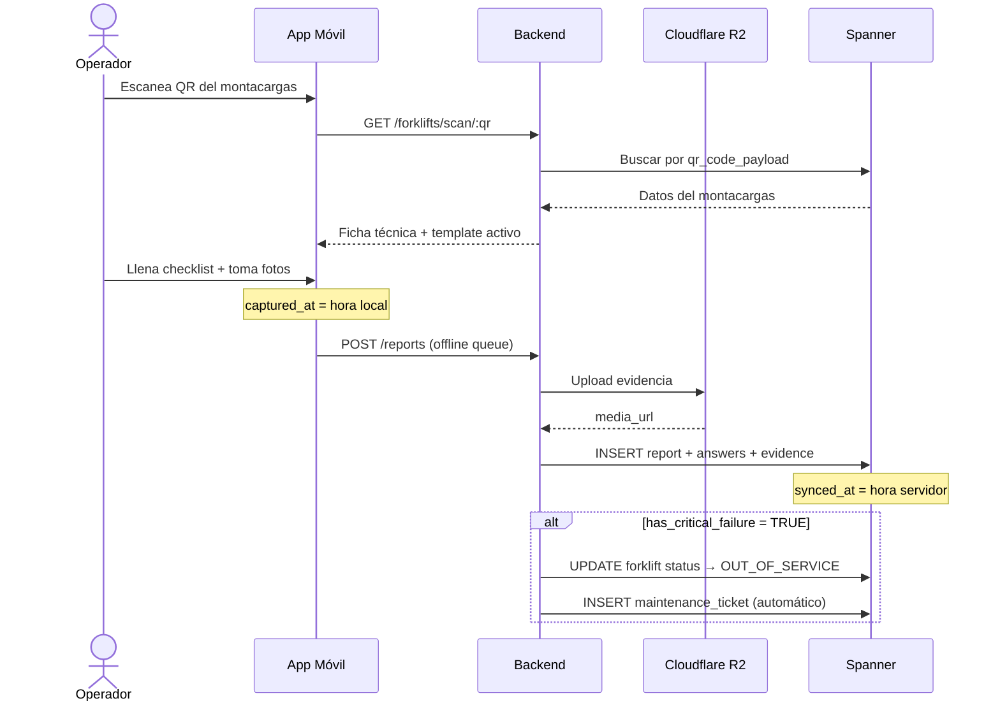
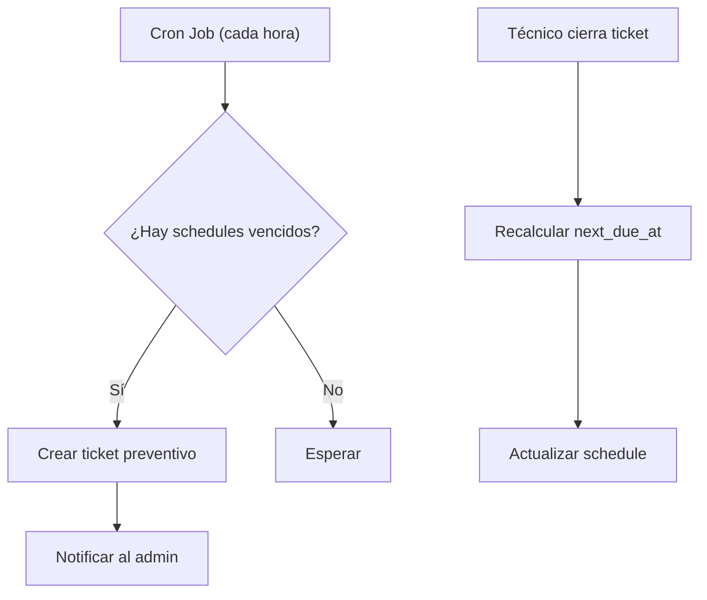
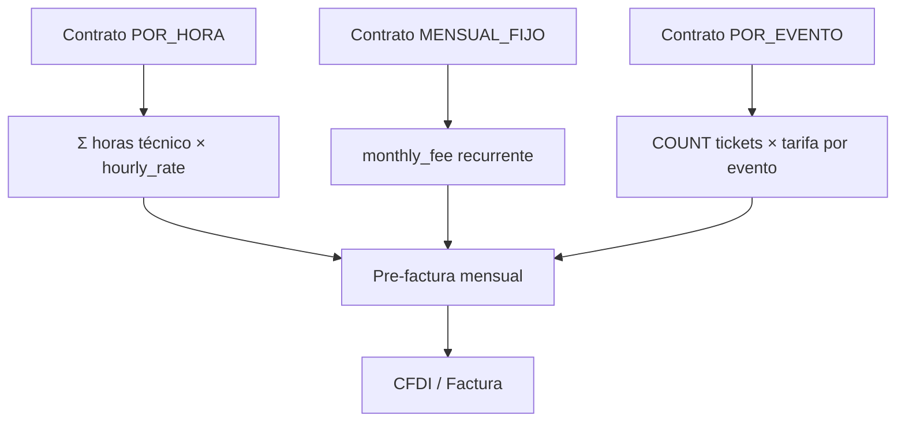
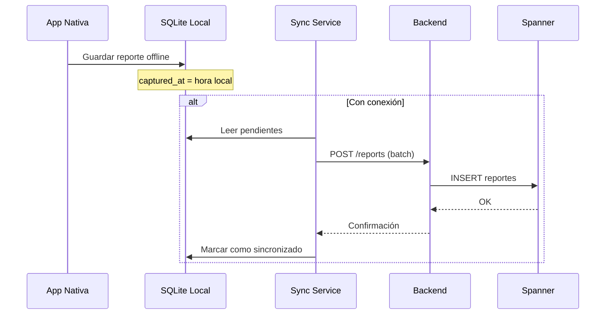
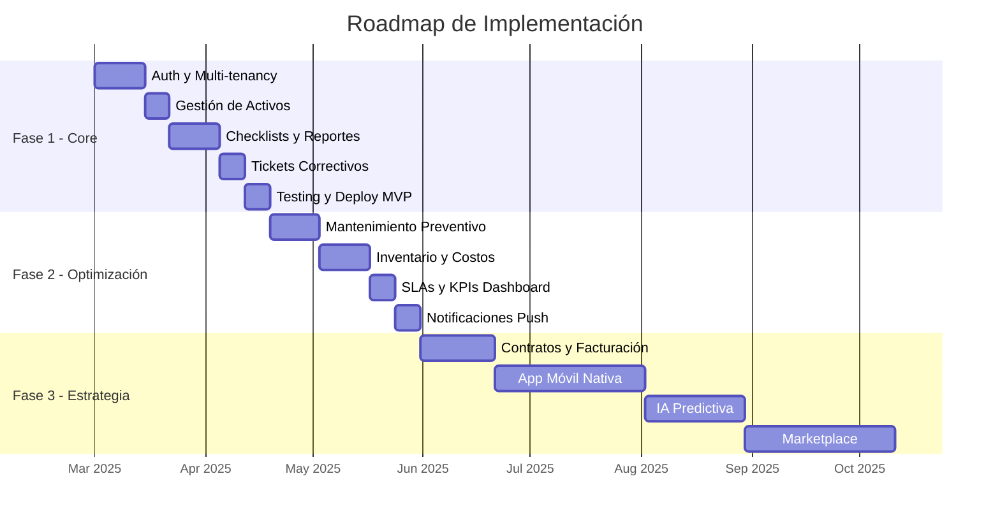

# Plan de Implementación — CMMS B2B SaaS

> **Producto**: Sistema de Gestión de Mantenimiento para Montacargas  
> **Modelo**: B2B SaaS Multi-tenant  
> **Stack Recomendado**: Next.js + Hono/Express + Spanner PostgreSQL + Cloudflare R2  
> **Base de datos**: [documentacion_db.md](file:///Users/bryanvargas/Developer/business/documentacion_db.md) | [tablasv2.sql](file:///Users/bryanvargas/Developer/business/tablasv2.sql)

---

## Visión General

```mermaid
graph LR
    subgraph FASE1["FASE 1: Core (MVP)"]
        A1["Auth & Multi-tenant"]
        A2["Gestión de Activos"]
        A3["Checklists & Reportes"]
        A4["Tickets Correctivos"]
    end

    subgraph FASE2["FASE 2: Optimización"]
        B1["Mantenimiento Preventivo"]
        B2["Inventario & Costos"]
        B3["SLAs & KPIs"]
        B4["Notificaciones Push"]
    end

    subgraph FASE3["FASE 3: Estrategia Futura"]
        C1["Contratos & Facturación"]
        C2["App Móvil Nativa"]
        C3["IA Predictiva"]
        C4["Marketplace de Refacciones"]
    end

    FASE1 --> FASE2 --> FASE3
```



---

## FASE 1: Core (MVP)

> **Objetivo**: Producto mínimo funcional que reemplace los procesos manuales.  
> **Duración estimada**: 6–8 semanas  
> **Resultado**: Un operador puede escanear un QR, llenar un checklist, y generar un ticket automáticamente.

### 1.1 Autenticación y Multi-Tenancy

**Tablas involucradas**: `clients`, `users`, `user_sessions`

| Tarea | Detalle | Prioridad |
|-------|---------|-----------|
| Registro de empresa (client) | Formulario con nombre, email, RFC, teléfono, plan de suscripción | P0 |
| CRUD de usuarios | Alta/baja de operadores, técnicos y admins | P0 |
| Login con JWT | Autenticación por email + password_hash (bcrypt) | P0 |
| Manejo de sesiones | Crear/expirar tokens en `user_sessions`, registrar device_info e IP | P0 |
| Middleware de tenant isolation | Cada query filtra por `client_id` del usuario autenticado | P0 |
| Roles y permisos | RBAC: OPERADOR (solo app), TECNICO (tickets), ADMIN (todo), CLIENTE (dashboard readonly) | P0 |

**Endpoints API:**

```
POST   /api/auth/login          → JWT token
POST   /api/auth/logout         → Invalidar sesión
GET    /api/auth/me             → Perfil del usuario
POST   /api/clients             → Registrar empresa (solo superadmin)
GET    /api/users               → Listar usuarios del tenant
POST   /api/users               → Crear usuario
PATCH  /api/users/:id           → Editar usuario
DELETE /api/users/:id           → Desactivar usuario (soft delete)
```

**Criterios de aceptación:**
- [x] Un admin puede crear cuentas para su empresa
- [x] Un usuario solo ve datos de su empresa (tenant isolation)
- [x] Las sesiones expiran automáticamente
- [x] Los passwords se almacenan como hash bcrypt

---

### 1.2 Gestión de Activos (Montacargas)

**Tablas involucradas**: `forklifts`, `client_locations`

| Tarea | Detalle | Prioridad |
|-------|---------|-----------|
| CRUD de ubicaciones | Plantar nombre, dirección, coordenadas GPS | P0 |
| CRUD de montacargas | Alta con internal_id, serial_number, modelo, marca, año, tipo combustible | P0 |
| Generación de QR | Generar payload único → código QR descargable/imprimible | P0 |
| Escaneo de QR | Endpoint que recibe el `qr_code_payload` y retorna datos del montacargas | P0 |
| Asignación a ubicación | Mover un montacargas entre plantas del cliente | P1 |
| Estado operativo | Cambiar entre OPERATIONAL / MAINTENANCE / OUT_OF_SERVICE | P0 |

**Endpoints API:**

```
GET    /api/locations            → Plantas del tenant
POST   /api/locations            → Crear planta
GET    /api/forklifts            → Listar montacargas del tenant
POST   /api/forklifts            → Registrar montacargas
GET    /api/forklifts/:id        → Detalle de un montacargas
PATCH  /api/forklifts/:id        → Editar montacargas
GET    /api/forklifts/scan/:qr   → Buscar por QR payload
PATCH  /api/forklifts/:id/status → Cambiar estado operativo
```

**Criterios de aceptación:**
- [x] Cada montacargas tiene un QR único e imprimible
- [x] Al escanear el QR se obtiene la ficha técnica completa
- [x] Un montacargas con `CRITICAL_STOP` se marca automáticamente como `OUT_OF_SERVICE`

---

### 1.3 Checklists y Reportes

**Tablas involucradas**: `checklist_templates`, `checklist_questions`, `reports`, `report_answers`, `report_evidence`

| Tarea | Detalle | Prioridad |
|-------|---------|-----------|
| CRUD de templates | Crear/versionar checklists con preguntas ordenadas | P0 |
| Configurar severidad | Asignar INFO / WARNING / CRITICAL_STOP a cada pregunta | P0 |
| Envío de reportes (offline-first) | El operador llena el checklist, se guarda con `captured_at` local y `synced_at` al enviar | P0 |
| Captura GPS | Registrar lat/lng al momento de la inspección (anti-fraude) | P0 |
| Upload de evidencia | Subir fotos/videos a Cloudflare R2, guardar URL en `report_evidence` | P0 |
| Flag automático | Si una respuesta es CRITICAL_STOP → `has_critical_failure = TRUE` | P0 |
| Historial de reportes | Listar reportes por montacargas, operador o fecha | P1 |

**Endpoints API:**

```
GET    /api/templates            → Templates activos del tenant
POST   /api/templates            → Crear template
GET    /api/templates/:id        → Detalle con preguntas

POST   /api/reports              → Enviar reporte completo (header + answers + evidence)
GET    /api/reports              → Listar reportes (filtros: forklift, user, fecha)
GET    /api/reports/:id          → Detalle con respuestas y evidencia

POST   /api/evidence/upload      → Upload a R2, retorna URL
```

**Flujo del operador:**



**Criterios de aceptación:**
- [x] Un reporte se puede llenar sin conexión a internet
- [x] La diferencia entre `captured_at` y `synced_at` es visible en el dashboard
- [ ] Las fotos se almacenan en R2 con URLs firmadas
- [x] Un CRITICAL_STOP genera automáticamente un ticket de mantenimiento

---

### 1.4 Tickets de Mantenimiento Correctivo

**Tablas involucradas**: `maintenance_tickets`

| Tarea | Detalle | Prioridad |
|-------|---------|-----------|
| Creación automática | Al detectar CRITICAL_STOP o WARNING en un reporte | P0 |
| Creación manual | Un admin puede abrir un ticket desde el dashboard | P1 |
| Asignación de técnico | Admin/sistema asigna `assigned_to` → registra `assigned_at` | P0 |
| Flujo de estados | ABIERTO → EN_PROCESO → CERRADO (con `resolved_at` y `resolution_notes`) | P0 |
| Generación de ticket_number | Secuencia legible generada por la app: TKT-0001, TKT-0002... | P0 |
| Vista técnico | Lista de tickets asignados con detalle del montacargas y reporte | P0 |

**Endpoints API:**

```
GET    /api/tickets              → Listar tickets (filtros: status, forklift, assigned_to)
POST   /api/tickets              → Crear ticket manual
GET    /api/tickets/:id          → Detalle completo
PATCH  /api/tickets/:id/assign   → Asignar técnico
PATCH  /api/tickets/:id/status   → Cambiar estado
PATCH  /api/tickets/:id/resolve  → Cerrar con notas
```

**Criterios de aceptación:**
- [x] Un reporte con falla crítica genera un ticket automáticamente
- [x] El técnico puede ver sus tickets asignados en la app (Lista global)
- [x] Al cerrar un ticket se registra `resolved_at` y `resolution_notes` (Estado básico)
- [ ] El dashboard muestra métricas de tickets abiertos/cerrados por técnico (Fase 2)

---

### Entregable Fase 1

```
✅ Login/Registro funcional con roles
✅ Alta y escaneo de montacargas con QR
✅ Checklist diario con evidencia fotográfica
✅ Tickets correctivos automáticos desde reportes
✅ Dashboard básico: montacargas, reportes, tickets
```

---

## FASE 2: Optimización

> **Objetivo**: Agregar inteligencia al sistema para tomar decisiones basadas en datos.  
> **Duración estimada**: 4–6 semanas  
> **Prerequisito**: Fase 1 completada y en producción con datos reales.

### 2.1 Mantenimiento Preventivo

**Tablas involucradas**: `preventive_schedules`, `maintenance_tickets` (schedule_id)

| Tarea | Detalle | Prioridad |
|-------|---------|-----------|
| CRUD de planes preventivos | Definir tareas recurrentes por montacargas o modelo | P0 |
| Frecuencia por horas | "Cambio de aceite cada 250 hrs" → alerta al acercarse | P0 |
| Frecuencia por calendario | "Revisión general cada 30 días" → alerta por fecha | P0 |
| Generación automática de tickets | Cuando `next_due_at` se cumple → crear ticket con `schedule_id` | P0 |
| Recálculo de próxima fecha | Al cerrar el ticket preventivo, recalcular `next_due_at` / `next_due_hours` | P0 |

**Lógica de negocio:**



**Criterios de aceptación:**
- [ ] Los preventivos generan tickets automáticamente al vencerse
- [ ] Un admin puede ver el calendario de mantenimientos próximos
- [ ] Al cerrar un preventivo, el sistema programa el siguiente automáticamente

---

### 2.2 Inventario y Control de Costos

**Tablas involucradas**: `parts_inventory`, `ticket_parts_used`, `ticket_costs`

| Tarea | Detalle | Prioridad |
|-------|---------|-----------|
| CRUD de refacciones | Catálogo con part_number, nombre, costo, proveedor, stock | P0 |
| Descontar stock | Al registrar `ticket_parts_used`, restar de `current_stock` | P0 |
| Alerta de stock bajo | Cuando `current_stock < min_stock` → notificación al admin | P1 |
| Registro de costos por ticket | Materiales, mano de obra, viáticos, refacciones | P0 |
| Costos billable vs no billable | Marcar qué costos se cobran al cliente y cuáles se absorben | P0 |
| Reporte de rentabilidad | Por cliente, por montacargas, por periodo | P1 |

**Query clave — Rentabilidad por cliente:**

```sql
SELECT
    c.name AS cliente,
    COUNT(t.id) AS total_tickets,
    SUM(tc.total_cost) AS costo_total,
    SUM(CASE WHEN tc.is_billable THEN tc.total_cost ELSE 0 END) AS cobrado,
    SUM(CASE WHEN NOT tc.is_billable THEN tc.total_cost ELSE 0 END) AS absorbido,
    sc.monthly_fee AS ingreso_mensual
FROM clients c
JOIN maintenance_tickets t ON t.forklift_id IN (SELECT id FROM forklifts WHERE client_id = c.id)
JOIN ticket_costs tc ON tc.ticket_id = t.id
LEFT JOIN service_contracts sc ON sc.client_id = c.id AND sc.is_active = TRUE
GROUP BY c.name, sc.monthly_fee;
```

**Criterios de aceptación:**
- [ ] El admin puede ver cuánto cuesta mantener cada cliente
- [ ] El sistema alerta cuando una refacción está por agotarse
- [ ] Cada ticket tiene desglose de costos visible en el dashboard

---

### 2.3 SLAs y KPIs

**Tablas involucradas**: `sla_definitions`, `maintenance_tickets`

| Tarea | Detalle | Prioridad |
|-------|---------|-----------|
| Definir SLAs por cliente | Tiempos máximos de respuesta y resolución por prioridad | P0 |
| Validación en tiempo real | Comparar `(NOW - created_at)` vs `max_response_minutes` | P0 |
| Alerta de SLA breach | Notificación cuando se está por incumplir un SLA | P0 |
| Dashboard de KPIs | MTTR, MTBF, tasa de cumplimiento SLA, tickets por técnico | P1 |

**KPIs del dashboard:**

| KPI | Fórmula | Tabla fuente |
|-----|---------|-------------|
| **MTTR** (Mean Time To Repair) | AVG(resolved_at - assigned_at) | maintenance_tickets |
| **Tiempo de respuesta** | AVG(assigned_at - created_at) | maintenance_tickets |
| **Cumplimiento SLA** | % tickets dentro del SLA | sla_definitions + tickets |
| **Tasa de fallas críticas** | COUNT(CRITICAL) / COUNT(total) reportes | reports |
| **Costo promedio por ticket** | SUM(total_cost) / COUNT(tickets) | ticket_costs |
| **Disponibilidad de flota** | COUNT(OPERATIONAL) / COUNT(total) | forklifts |

**Query clave — MTTR por técnico:**

```sql
SELECT
    u.full_name AS tecnico,
    COUNT(t.id) AS tickets_cerrados,
    AVG(EXTRACT(EPOCH FROM (t.resolved_at - t.assigned_at)) / 3600) AS mttr_horas
FROM maintenance_tickets t
JOIN users u ON t.assigned_to = u.id
WHERE t.status = 'CERRADO' AND t.resolved_at IS NOT NULL
GROUP BY u.full_name
ORDER BY mttr_horas ASC;
```

---

### 2.4 Notificaciones Push

**Tablas involucradas**: `notifications`

| Tarea | Detalle | Prioridad |
|-------|---------|-----------|
| Sistema de notificaciones in-app | Crear registros en `notifications` por cada evento | P0 |
| Push notifications (FCM/APNs) | Enviar push al dispositivo del técnico al asignarle un ticket | P1 |
| Email de alertas | Enviar email al admin cuando hay SLA breach o stock bajo | P2 |
| Centro de notificaciones | Vista en el dashboard/app con filtro de leídas/no leídas | P1 |

**Triggers de notificación:**

| Evento | Destinatario | Canal |
|--------|-------------|-------|
| Ticket asignado | Técnico | Push + In-app |
| SLA por vencer (80% del tiempo) | Admin | Push + Email |
| SLA incumplido | Admin + Cliente | Email |
| Stock bajo | Admin | In-app |
| Preventivo por vencer | Admin | In-app |
| Reporte con falla crítica | Admin | Push + In-app |

---

### Entregable Fase 2

```
✅ Mantenimiento preventivo automatizado
✅ Control de inventario con alertas de stock
✅ Costos por ticket con análisis de rentabilidad
✅ SLAs con alertas de incumplimiento
✅ Dashboard de KPIs: MTTR, disponibilidad, costos
✅ Notificaciones push y por email
```

---

## FASE 3: Estrategia Futura

> **Objetivo**: Escalar el producto, generar ingresos recurrentes y diferenciarse con tecnología.  
> **Duración estimada**: 3–6 meses  
> **Prerequisito**: Fase 2 validada con al menos 3 clientes activos.

### 3.1 Contratos y Facturación Automatizada

**Tablas involucradas**: `service_contracts`, `contract_forklifts`

| Iniciativa | Descripción |
|------------|-------------|
| Gestión de contratos | CRUD con tipos: por hora, mensual fijo, por evento |
| Cobertura por montacargas | Definir qué equipos cubre cada contrato via `contract_forklifts` |
| Cálculo automático de cobro | Según tipo de contrato: sumar horas, cuota fija, o contar eventos |
| Integración con facturación | Generar pre-facturas PDF o conectar con sistema SAT/CFDI |
| Vencimiento de contratos | Alertas 30 días antes de que expire un contrato |
| Renovación automática | Opción de auto-renovar contratos al vencimiento |

**Modelo de ingresos:**



---

### 3.2 App Móvil Nativa

| Iniciativa | Descripción |
|------------|-------------|
| React Native / Flutter | App nativa para iOS y Android |
| Offline-first completo | SQLite local → sync con Spanner al tener conexión |
| Escaneo de QR nativo | Cámara integrada para escaneo rápido |
| Captura de evidencia | Fotos con metadata GPS y timestamp embebido |
| Firma digital | El operador firma la inspección en pantalla |
| Modo técnico | Vista especializada para ver tickets y registrar costos en campo |

**Arquitectura offline:**



---

### 3.3 Inteligencia Artificial Predictiva

| Iniciativa | Descripción |
|------------|-------------|
| Predicción de fallas | Analizar historial de reportes para predecir cuándo fallará un equipo |
| Optimización de preventivos | Ajustar frecuencias de mantenimiento basándose en datos reales vs teóricos |
| Anomalía en costos | Detectar tickets inusualmente caros o técnicos con MTTR anormal |
| Recomendación de refacciones | Sugerir qué piezas ordenar basándose en consumo histórico |
| Score de salud del montacargas | 0-100 basado en edad, horas, historial de fallas, último mantenimiento |

**Datos para entrenar modelos:**

| Feature | Fuente |
|---------|--------|
| Horas de uso | `forklifts.current_hours` |
| Frecuencia de fallas | COUNT de `reports` con `has_critical_failure = TRUE` |
| Tiempo entre fallas | Diferencia entre reportes con falla por montacargas |
| Costos acumulados | SUM de `ticket_costs.total_cost` por montacargas |
| Edad del equipo | `forklifts.year` vs año actual |
| Historial de respuestas | Patrones en `report_answers` |

---

### 3.4 Marketplace de Refacciones

| Iniciativa | Descripción |
|------------|-------------|
| Catálogo compartido | Base de datos de refacciones por marca/modelo de montacargas |
| Cotización automática | El sistema sugiere proveedores y precios al crear un ticket |
| Red de proveedores | Portal para que proveedores publiquen piezas y precios |
| Compra directa | Integración con pasarelas de pago para compra desde la app |
| Logística de entrega | Tracking de envío de refacciones al técnico en campo |

---

### Entregable Fase 3

```
✅ Contratos con cálculo automático de cobro
✅ Facturación automatizada (CFDI)
✅ App nativa iOS/Android con modo offline
✅ IA predictiva para mantenimiento
✅ Score de salud por montacargas
✅ Marketplace de refacciones (visión a largo plazo)
```

---

## Orden de Implementación Recomendado



---

## Stack Tecnológico Recomendado

| Capa | Tecnología | Justificación |
|------|-----------|---------------|
| **Frontend Web** | Next.js 14 (App Router) | SSR, API routes, optimización SEO |
| **Frontend Móvil** | React Native / Expo | Código compartido con web |
| **Backend API** | Hono / Express.js | Ligero, edge-compatible |
| **Base de Datos** | Spanner PostgreSQL | Escalabilidad global, multi-región |
| **Almacenamiento** | Cloudflare R2 | Evidencia multimedia, económico |
| **Autenticación** | JWT + bcrypt | Sesiones stateless |
| **Push Notifications** | Firebase Cloud Messaging | Cross-platform |
| **Email** | Resend / SendGrid | Transaccional y alertas |
| **Hosting** | Vercel + Cloud Run | Serverless, auto-scaling |
| **Monitoreo** | Sentry + Grafana | Errores y performance |
| **CI/CD** | GitHub Actions | Automatización de deploys |

---

## Métricas de Éxito por Fase

| Fase | Métrica | Target |
|------|---------|--------|
| **Core** | Reportes diarios enviados | >50/semana por cliente |
| **Core** | Tiempo de adopción | <2 semanas desde onboarding |
| **Optimización** | Cumplimiento de SLA | >90% |
| **Optimización** | Reducción de downtime | -30% vs pre-CMMS |
| **Optimización** | Visibilidad de costos | 100% tickets con desglose |
| **Estrategia** | Clientes activos | >10 empresas |
| **Estrategia** | MRR (Monthly Recurring Revenue) | Meta según pricing |
| **Estrategia** | Predicción de fallas | >70% accuracy |
